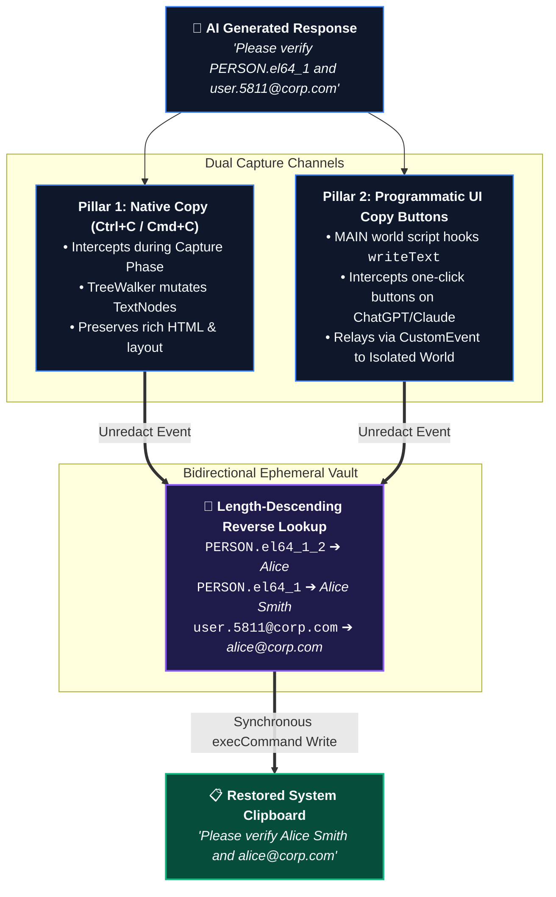
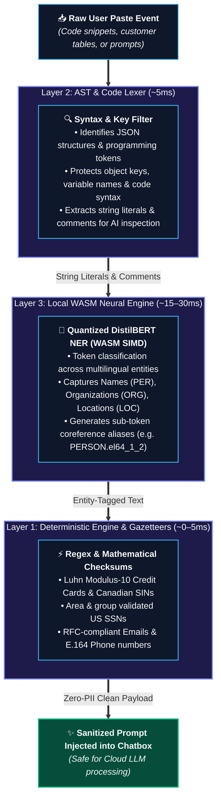
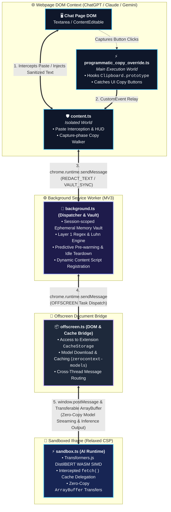

# ZeroContext 🛡️

> **Use AI without the privacy risk.** A local-first, zero-latency Data Loss Prevention (DLP) Chrome Extension (Manifest V3) that automatically redacts sensitive data before it reaches the cloud—and seamlessly restores it when you copy the AI's response.

[](https://www.typescriptlang.org/)
[](https://developer.chrome.com/docs/extensions/mv3/intro/)
[](#zero-trust-privacy-principles)
[](https://huggingface.co/docs/transformers.js)
[-success.svg)](https://vitest.dev/)
[](LICENSE)

---

## 📑 Table of Contents

- [Why ZeroContext?](#why-zerocontext)
- [✨ Key Features & Capabilities](#-key-features--capabilities)
- [⚡ The Core Innovation: Two-Way Redaction & Unredaction](#-the-core-innovation-two-way-redaction--unredaction)
  - [Why Traditional Redaction Tools Fail](#why-traditional-redaction-tools-fail)
  - [ZeroContext's Semantic Dot-Notation & Vault Engine](#zerocontexts-semantic-dot-notation--vault-engine)
  - [The Dual-Pillar Unredaction System](#the-dual-pillar-unredaction-system)
- [🔬 The 3-Layer Zero-Trust Redaction Engine](#-the-3-layer-zero-trust-redaction-engine)
- [🏗️ System Architecture & Design Choices](#️-system-architecture--design-choices)
  - [3-Tier Process & Thread Isolation](#3-tier-process--thread-isolation)
  - [Overcoming Manifest V3 Constraints: The `blob:` Ban & CSP](#overcoming-manifest-v3-constraints-the-blob-ban--csp)
  - [Null-Origin Cache Delegation](#null-origin-cache-delegation)
  - [Smart Lifecycle Management & Predictive Pre-Warming](#smart-lifecycle-management--predictive-pre-warming)
  - [Zero-Trust Domain Gatekeeper (No `<all_urls>`)](#zero-trust-domain-gatekeeper-no-all_urls)
  - [Strict TypeScript & Production Engineering Standards](#strict-typescript--production-engineering-standards)
- [📁 Project Directory Structure](#-project-directory-structure)
- [🚀 Getting Started & Local Setup](#-getting-started--local-setup)
- [🧪 Testing & Quality Assurance](#-testing--quality-assurance)
  - [Unit & Integration Testing (Vitest)](#unit--integration-testing-vitest)
  - [End-to-End Testing (Playwright)](#end-to-end-testing-playwright)
- [🔄 Local TDD & Contribution Workflow](#-local-tdd--contribution-workflow)
- [📄 License & Disclaimers](#-license--disclaimers)

---

## 🔍 Why ZeroContext?

Every day, developers, lawyers, healthcare workers, and financial analysts paste sensitive proprietary information into public AI chatbots like **ChatGPT**, **Claude**, **Gemini**, **Perplexity**, and **DeepSeek**.

Standard paste actions frequently leak:
- **Personally Identifiable Information (PII):** Customer names, addresses, emails, phone numbers, SSNs, SINs.
- **Financial Data:** Credit card numbers, bank routing codes.
- **Proprietary Code & Secrets:** API keys, database credentials, internal server endpoints embedded in code snippets or stack traces.

### The ZeroContext Solution

ZeroContext acts as an **in-browser, two-way local proxy**. When you paste text into an AI text field, ZeroContext intercepts the paste event, extracts sensitive entities, substitutes them with syntactically sound and context-preserving tokens, and sends only the sanitized payload to the AI provider.

When the AI generates a response and you click "Copy" or press `Ctrl+C` / `Cmd+C`, ZeroContext **automatically restores the original data** directly into your clipboard.

### Zero-Trust Privacy Principles

| Principle | ZeroContext Implementation |
| :--- | :--- |
| **100% In-Browser Execution** | All machine learning (NER) and regex parsing runs locally on your machine via WebAssembly (WASM). |
| **Zero Cloud APIs** | No telemetry, no remote logging, no external LLM calls. Zero network dependencies after initial model cache. |
| **Ephemeral Memory** | Entity mapping vaults are stored strictly in memory (`chrome.storage.session`) isolated per browser tab, and are permanently wiped when the tab closes or navigates away. |
| **Zero-Trust Permissions** | Never asks for broad `<all_urls>` access. Statically targets verified AI domains and dynamically requests granular host permissions only when added by the user. |

---

## ✨ Key Features & Capabilities

<table>
  <tr>
    <td width="50%">
      <h3>🔄 Automatic Two-Way Unredaction</h3>
      <p>The only extension that doesn't leave you stranded with masked text. Seamlessly restores original names, emails, and secrets upon copying the AI response—across both manual selection (<code>Ctrl+C</code>) and one-click interface copy buttons.</p>
    </td>
    <td width="50%">
      <h3>⚡ Sub-50ms Redaction Latency</h3>
      <p>Combining instant deterministic regex checks with multithreaded WASM token classification to ensure you never experience typing or pasting lag.</p>
    </td>
  </tr>
  <tr>
    <td width="50%">
      <h3>🧠 Semantic Dot-Notation Tokens</h3>
      <p>Replaces PII with semantic tokens (e.g., <code>PERSON.el64_1</code>, <code>user.5811@example.com</code>) instead of destructive <code>[REDACTED]</code> tags. Preserves LLM reasoning, prevents markdown link corruption, and avoids syntax errors.</p>
    </td>
    <td width="50%">
      <h3>🎛️ Dual Engine Protection Modes</h3>
      <p><b>Standard Mode:</b> Lightning-fast deterministic rules for Credit Cards, SSNs, SINs, Emails, and Phones.<br/>
      <b>Smart Mode (Default):</b> Adds client-side Quantized DistilBERT AI NER to catch unstructured names, organizations, and addresses.</p>
    </td>
  </tr>
  <tr>
    <td width="50%">
      <h3>🌐 Dynamic Domain Gatekeeper</h3>
      <p>Built-in zero-trust security. Protects Big 5 AI providers out of the box (ChatGPT, Claude, Gemini, Perplexity, DeepSeek) while allowing one-click additions of custom enterprise or self-hosted AI portals.</p>
    </td>
    <td width="50%">
      <h3>📴 Offline Resilience & Auto-Recovery</h3>
      <p>Gracefully detects network drops, switches automatically to Standard Mode, and self-heals when back online without interrupting your workflow.</p>
    </td>
  </tr>
  <tr>
    <td width="50%">
      <h3>♻️ Smart Memory Lifecycle</h3>
      <p>Predictive pre-warming spins up the neural engine when you switch to an AI tab, and an automated 5-minute idle alarm tears down offscreen documents to save ~500MB of RAM.</p>
    </td>
    <td width="50%">
      <h3>🎨 Modern Dark-Mode Popup HUD</h3>
      <p>Sleek, lightweight popup built with Pico.css offering real-time status toggles, site management, engine switching, and non-intrusive download progress toasts.</p>
    </td>
  </tr>
</table>

---

## ⚡ The Core Innovation: Two-Way Redaction & Unredaction

### Why Traditional Redaction Tools Fail

Most privacy extensions and redaction scripts suffer from four critical flaws that make them unusable for developers and knowledge workers:

1. **One-Way Dead Ends:** They redact on paste, but offer **no automated way to unredact** the response. The user must manually find and replace placeholders or maintain a separate decryptor window.
2. **Context Pollution:** Replacing multiple entities with generic labels like `[REDACTED]` or `[NAME]` destroys context. If "Alice" and "Bob" are both replaced by `[NAME]`, the LLM cannot track who did what:
   ```text
   Original: "Alice assigned the ticket to Bob, and then Bob emailed Alice."
   Naively Redacted: "[NAME] assigned the ticket to [NAME], and then [NAME] emailed [NAME]." ❌ (Context Destroyed)
   ```
3. **Markdown Syntax Collisions:** Square brackets (`[...]`) trigger markdown link and formatting parsers inside web chat interfaces. The AI client often attempts to render them as broken hyperlink tags or mangled code blocks.
4. **Code & JSON Destruction:** Naive regex tools replace substrings inside JSON keys, HTML attributes, or variable declarations, breaking code syntax before the LLM can analyze it.

---

### ZeroContext's Semantic Dot-Notation & Vault Engine

ZeroContext replaces sensitive entities with **semantic dot-notation tokens coupled with alphanumeric salts and entity counters**:

```text
Original: "Send the invoice for Alice Smith (alice@corp.com) to Bob Jones."
ZeroContext Redacted: "Send the invoice for PERSON.el64_1 (user.5811@example.com) to PERSON.el64_2."
```

#### Key Advantages:

- **Zero Square Brackets:** Dot-notation (`PERSON.el64_1`) is treated as plain literal text by LLMs and markdown renderers, completely eliminating broken links or corrupted markdown formatting.
- **Semantic Type Preservation:** The LLM still understands that `PERSON.el64_1` is a person and `user.5811@example.com` is an email address, allowing it to produce grammatically and logically coherent responses.
- **Deterministic Salting & TabId Normalization:** Salts are generated using normalized tab identifiers (`tabId % 100`) and random alphanumeric seeds, preventing cross-tab collision and token overlap.
- **Universal Alias Routing & Coreference Resolution:** If "Alice Smith" is identified as `PERSON.el64_1`, subsequent single-token references like "Alice" are automatically mapped to `PERSON.el64_1_2`. This preserves character coreference throughout long conversations.

---

### The Dual-Pillar Unredaction System

ZeroContext features an automated two-way restoration pipeline operating across both user-initiated and programmatic copy actions:



#### Pillar 1: Native Selection & Copy Interception (Capture Phase)
- Listens to native `copy` events in the **event capture phase (`true`)** before the web application's event bubbling can hijack or override the selection.
- Clones selected document fragments and runs a `TreeWalker` over `NodeFilter.SHOW_TEXT` nodes, updating only raw text values while **preserving complete rich-text HTML formatting and layout**.
- Replaces tokens in descending length order to ensure sub-tokens (e.g., `PERSON.el64_1_2`) are resolved before parent canonical tokens (`PERSON.el64_1`).

#### Pillar 2: Programmatic UI Copy-Button Interception
- Modern AI interfaces (ChatGPT, Claude, Gemini) use one-click "Copy code" or "Copy response" buttons that bypass native selection by directly calling `navigator.clipboard.writeText()` or `navigator.clipboard.write()`.
- ZeroContext injects a lightweight interceptor (`src/programmatic_copy_override.ts`) into the **MAIN execution world** at `document_start`.
- When an AI client invokes `writeText()`, the hook intercepts the unredacted payload, broadcasts a custom event to the isolated content script, unredacts the payload against the tab's memory vault, and writes the restored string to the system clipboard via `document.execCommand('copy')` (leveraging extension `clipboardWrite` privileges without user-gesture expiration errors).

---

## 🔬 The 3-Layer Zero-Trust Redaction Engine

ZeroContext employs a tiered execution pipeline to combine high throughput with neural comprehension:



### Layer 1: Deterministic Engine & Mathematical Gazetteers (0–5ms)
- **Credit Cards:** Captures major card formats and executes a synchronous **Modulus-10 (Luhn Algorithm)** check to eliminate false positives on random 16-digit numbers.
- **Social Security Numbers (US SSN):** Validates area, group, and serial boundaries (rejecting invalid prefixes like `000`, `666`, or `900-999`).
- **Social Insurance Numbers (Canadian SIN):** Formatted and unformatted 9-digit validation using Luhn checksums.
- **Emails & Phone Numbers:** Strict RFC-compliant patterns and international E.164 phone formats.

### Layer 2: AST & Code Lexer (5ms)
- Automatically detects whether pasted text is JSON, source code, or plain English prose.
- Protects programming syntax: skips JSON keys (`"userId": "..."`), object properties, language keywords (`const`, `function`, `import`), and function calls.
- Isolates and forwards only user-defined string literals (`"..."`, `'...'`, `` `...` ``) and code comments (`// ...`, `/* ... */`) to the neural engine.

### Layer 3: Local WASM Neural Engine (15–30ms)
- Employs a quantized **DistilBERT Named Entity Recognition (NER)** model (`Xenova/distilbert-base-multilingual-cased-ner-hrl`) executing via ONNX Runtime Web compiled to WebAssembly.
- Detects unstructured proper nouns: personal names (`PER`), organization titles (`ORG`), and geographic locations (`LOC`).
- Operates entirely offline using client-side WASM SIMD threads.

---

## 🏗️ System Architecture & Design Choices

The architecture of ZeroContext is designed specifically to overcome the strict constraints of Chrome Extension Manifest V3 (MV3).



### 1. 3-Tier Process & Thread Isolation
Heavy matrix math and token classification cannot run on the webpage main thread without causing UI jank and dropped frames. ZeroContext isolates workloads across three boundaries:
1. **The Dispatcher (`background.ts`):** Coordinates lifecycle events, maintains the ephemeral per-tab vault cache, and handles dynamic content-script injection.
2. **The Bridge (`offscreen.ts`):** An invisible Offscreen Document with access to standard DOM APIs and extension `CacheStorage`.
3. **The Sandbox (`sandbox.ts`):** An isolated iframe declared in `manifest.json` under `"sandbox"`, executing `@huggingface/transformers` and ONNX Runtime.

---

### 2. Overcoming Manifest V3 Constraints: The `blob:` Ban & CSP

#### The Problem:
Under Manifest V3, extension service workers and extension pages enforce a strict Content Security Policy (CSP) that explicitly bans `blob:` script execution and dynamic `eval()`. However, ONNX Runtime Web depends on `blob:` URLs to initialize Emscripten pthread Web Workers.

#### The Solution:
ZeroContext executes machine learning inside a **Sandboxed Iframe** with an explicitly relaxed sandbox CSP:
```json
"content_security_policy": {
  "extension_pages": "script-src 'self' 'wasm-unsafe-eval'; object-src 'self';",
  "sandbox": "sandbox allow-scripts allow-forms allow-popups allow-modals; script-src 'self' 'unsafe-inline' 'unsafe-eval' blob:; child-src 'self' blob:;"
}
```
*Note: Due to a known issue where `@crxjs/vite-plugin` strips the `"sandbox"` CSP directive at build time, ZeroContext uses a custom Vite plugin (`vite.config.ts`) that verifies and re-injects the sandbox CSP into `dist/manifest.json` upon build.*

---

### 3. Null-Origin Cache Delegation

#### The Problem:
Sandboxed iframes run under a `null` security origin. Attempting to call `caches.open()` or access browser `IndexedDB`/`CacheStorage` inside the sandbox triggers a fatal `SecurityError`. Without caching, the ~65MB–135MB quantized DistilBERT ONNX model bundle would have to be downloaded repeatedly on every browser session.

#### The Solution:
ZeroContext implements a **Fetch Delegation Interceptor**:
1. `sandbox.ts` intercepts `globalThis.fetch` for model file requests.
2. The fetch request is forwarded via `postMessage` to `offscreen.ts`.
3. `offscreen.ts` checks the extension's `zerocontext-models` CacheStorage.
4. On a cache miss, `offscreen.ts` downloads the model bundle once, validates headers, caches the response, and transfers the raw `ArrayBuffer` back to the sandbox using zero-copy transferables (`transfer: [arrayBuffer]`).
5. A strict 120-second timeout guard prevents hanging promises if a message is dropped.

---

### 4. Smart Lifecycle Management & Predictive Pre-Warming

Loading neural networks into browser memory consumes ~500MB of RAM. Keeping the model permanently resident degrades system performance.

ZeroContext implements an autonomous lifecycle manager:
- **Predictive Pre-Warming:** Listening to `chrome.tabs.onActivated` and `chrome.tabs.onUpdated`, ZeroContext initializes the offscreen document and pre-warms the WASM model the moment an AI domain tab gains focus.
- **Idle Teardown Alarms:** When switching away from an AI tab, `chrome.alarms` schedules a 5-minute teardown. If no AI tab is focused within 5 minutes, the offscreen document and its entire WASM runtime are closed, immediately reclaiming memory.

---

### 5. Zero-Trust Domain Gatekeeper (No `<all_urls>`)

Most extensions request `<all_urls>` or `http://*/*` permissions, granting them the ability to read passwords, bank accounts, and personal data across every website you visit.

ZeroContext rejects this model:
- Statically declares host permissions only for verified AI providers:
  - `*://*.chatgpt.com/*`
  - `*://*.claude.ai/*`
  - `*://*.gemini.google.com/*`
  - `*://*.perplexity.ai/*`
  - `*://chat.deepseek.com/*`
- Uses `chrome.permissions.request()` and `chrome.scripting.registerContentScripts()` to allow users to dynamically protect self-hosted or corporate AI domains (e.g., `ollama.internal`, `ai.company.com`) without granting universal browser access.

---

### 6. Strict TypeScript & Production Engineering Standards

- **Zero `any` Policy:** Zero instances of `any`. All external boundaries and messages are validated using [Zod](https://zod.dev/) schemas.
- **Discriminated Unions:** All cross-thread communication (Background ⇄ Offscreen ⇄ Sandbox) is modeled as exhaustive Discriminated Unions:
  ```typescript
  export type WorkerMessage =
    | { action: 'PING'; taskId: string }
    | { action: 'PREWARM_MODEL'; taskId: string }
    | { action: 'PROCESS_TEXT'; taskId: string; payload: { texts: string[] } }
    | { action: 'SIMULATE_HEAVY_WORKLOAD'; taskId: string; payload?: { durationMs?: number } };
  ```
- **Exhaustive Type Checking:** State switches implement TypeScript exhaustiveness checking via the `never` type.
- **Deep Pure Modules:** Core logic (`nerProcessor.ts`, `lexer.ts`, `regexEngine.ts`, `vault.ts`) contains zero Chrome API dependencies, enabling sub-second unit testing in native Node/Vitest environments.

---

## 📁 Project Directory Structure

```text
zero-context/
├── .agents/                    # Workflows and agent development directives
├── docs/
│   └── adr/                    # Architecture Decision Records (ADRs)
├── public/
│   └── icons/                  # Extension icons (16, 32, 48, 128px)
├── src/
│   ├── offscreen/              # Offscreen document bridge & cache manager
│   │   ├── offscreen.html
│   │   ├── offscreen.ts        # Cache delegation & Chrome message routing
│   │   ├── offscreen-manager.ts# Singleton lifecycle & task dispatch
│   │   └── types.ts
│   ├── sandbox/                # Sandboxed WASM execution environment
│   │   ├── sandbox.html
│   │   ├── sandbox.ts          # Transformers.js WASM runtime & pipeline
│   │   └── fetchHelper.ts      # Fetch interception utilities
│   ├── types/                  # Shared TypeScript interfaces & Zod schemas
│   │   ├── domain.ts           # Domain gatekeeper schemas
│   │   ├── ner.ts              # NER token interfaces
│   │   └── progress.ts         # Progress and broadcast message types
│   ├── ui/                     # UI components
│   │   ├── DomainConfigUI.ts   # Domain management list UI
│   │   ├── ZeroContextToast.ts # Content script HUD toast
│   │   └── onboarding.ts       # First-run welcome page logic
│   ├── background.ts           # Service worker, lifecycle & dispatcher
│   ├── content.ts              # Content script (Pillar 1 unredaction & paste HUD)
│   ├── domainGatekeeper.ts     # Domain matching & dynamic scripting sync
│   ├── injected.ts             # Domain gatekeeper injection script
│   ├── lexer.ts                # AST & code syntax parser
│   ├── main.ts                 # Extension popup controller
│   ├── nerProcessor.ts         # Pure NER output-to-vault transformation
│   ├── programmatic_copy_override.ts # Pillar 2 MAIN-world copy interceptor
│   ├── regexEngine.ts          # Layer 1 deterministic regex & Luhn validator
│   ├── semanticMapper.ts       # NER tag to semantic entity mapping
│   ├── style.css               # Popup and HUD stylesheets
│   └── vault.ts                # Ephemeral per-tab bidirectional vault
├── tests/
│   └── e2e/                    # Playwright End-to-End test suite
│       ├── fixtures.ts         # Chrome extension test fixture
│       ├── mocks/              # Mock HTML fixtures for ChatGPT / Claude DOMs
│       └── redaction.spec.ts   # Full-pipeline E2E test specs
├── index.html                  # Extension popup HTML
├── onboarding.html             # First-run onboarding page HTML
├── manifest.json               # Manifest V3 configuration
├── playwright.config.ts        # Playwright E2E configuration
├── vite.config.ts              # Vite + CRXJS build configuration
├── tsconfig.json               # Strict TypeScript configuration
└── LICENSE                     # MIT License
```

---

## 🚀 Getting Started & Local Setup

### Prerequisites
- **Node.js:** `v18.0.0` or higher
- **npm:** `v9.0.0` or higher
- **Google Chrome** or any Chromium-based browser (Brave, Edge, Arc)

### 1. Clone & Install Dependencies
```bash
git clone https://github.com/your-username/zero-context.git
cd zero-context
npm install
```

### 2. Run the Development Server
```bash
npm run dev
```
This starts Vite in watch mode and outputs the built extension to the `dist/` directory.

### 3. Load the Extension in Chrome
1. Open Google Chrome and navigate to `chrome://extensions/`.
2. Enable **Developer mode** (toggle in the top-right corner).
3. Click **Load unpacked**.
4. Select the `dist/` folder inside this repository.
5. The ZeroContext shield icon will now appear in your extension toolbar.

### 4. Build for Production
```bash
npm run build
```
Runs the TypeScript compiler (`tsc --noEmit`) and creates an optimized production bundle in `dist/`.

---

## 🧪 Testing & Quality Assurance

ZeroContext maintains a comprehensive test suite covering pure unit logic, lifecycle state machines, and full-stack browser DOM interactions.

```
                   120+ Tests Executed Locally Across 2 Frameworks
        ┌──────────────────────────────────┬──────────────────────────────────┐
        │        Vitest Unit Suite         │       Playwright E2E Suite       │
        ├──────────────────────────────────┼──────────────────────────────────┤
        │ • Luhn & SSN validation          │ • Full Chrome Extension Loading  │
        │ • AST Lexer & Code parsing       │ • ContentEditable Paste Capture  │
        │ • Bidirectional Vault mapping    │ • Live WASM Model Download       │
        │ • Domain Gatekeeper & Patterns   │ • Neural Redaction Execution     │
        │ • Offscreen singleton management │ • Programmatic Copy Unredaction  │
        │ • Lifecycle Alarms & Pre-warming │ • Multi-Tab Isolation Testing    │
        └──────────────────────────────────┴──────────────────────────────────┘
```

### Unit & Integration Testing (Vitest)
All core modules are decoupled from the Chrome API surface, allowing instant, deterministic test runs:

```bash
# Run all unit and integration tests
npm run test

# Run tests in single-run mode
npx vitest run
```

### End-to-End Testing (Playwright)
Playwright launches a live Chromium instance with the built unpacked extension loaded from `dist/`, injecting real mock DOMs replicating ChatGPT and Claude `contenteditable` editors:

```bash
# Build the latest extension bundle first
npm run build

# Execute the E2E test suite
npm run test:e2e
```

### Type Checking
```bash
npm run typecheck
```

---

## 🔄 Local TDD & Contribution Workflow

We follow a strict **Test-Driven Development (TDD)** and **Deep Module** engineering philosophy:

1. **Blue Phase (Type-First Blueprinting):** Define TypeScript interfaces, discriminated unions, and Zod schemas in `src/types/` before writing implementation code.
2. **Red Phase (Test First):** Write unit tests in Vitest that capture edge cases, malformed data, and ReDoS vulnerabilities. Verify that the test suite fails.
3. **Green Phase (Implementation):** Implement the logic to pass the tests. Code is complete only when `npm run typecheck` and `npm run test` pass with zero warnings.
4. **Code Quality Standards:**
   - No `any` types. Use `unknown` with Zod parsing.
   - Use `satisfies` for configuration objects.
   - Never use square brackets (`[...]`) for redaction tokens.
   - All tab IDs used in string token generation must be normalized (`tabId % 100`).

---

## 📄 License & Disclaimers

This project is licensed under the **[MIT License](LICENSE)**.

### Summary of Terms:
- **Commercial & Personal Use:** You are free to use, modify, distribute, fork, and integrate this software in private or commercial applications.
- **Attribution Required:** You must retain the original copyright notice and license text in any copy or substantial portion of the software.
- **Zero Liability & No Warranty:** The software is provided **"AS IS"**, without warranty of any kind. The authors and maintainers disclaim all liability for any damages, data loss, or claims arising from its use.

### Built With:
- [@huggingface/transformers](https://github.com/huggingface/transformers.js) - Machine learning for the web
- [ONNX Runtime Web](https://onnxruntime.ai/) - High-performance client-side WASM inference
- [Pico.css](https://picocss.com/) - Minimal and elegant semantic CSS
- [Vite](https://vitejs.dev/) & [@crxjs/vite-plugin](https://crxjs.dev/vite-plugin) - Modern Chrome extension tooling
- [Vitest](https://vitest.dev/) & [Playwright](https://playwright.dev/) - Reliable testing frameworks
